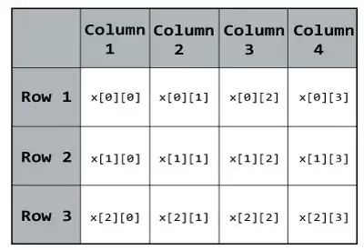

#Arrays e Collections
## O que são Arrays?
Todo Array é um **OBJETO**, podendo ser de diversos tipos.
Para declarar um array utilizamos a seguinte sintaxe:
 ````java
 int[] idades = new int[10];
 ````

O ``int[10]`` determina a quantidade de posições que o array terá.
Também podemos definir isso criando uma constante:
````java 
final int qtd_idades = 10;
int[] idades = new int[qtd_idades];
````
> Lembrando que um array sempre que é declarado, tem sua posição inicial igual a **ZERO**!


## "Array de Objetos" / de Referência
Com um array de objetos queremos dizer que este **array** faz referências a uma determinada **Classe**.

Declarando um array de objetos:
````java
Jogador[] jogadores = new Jogadores[qtd_jogadores];
```` 
> *Um array de tipos primitivos guarda valores, um array de objetos guarda referências*

Para inserir em arrays de valores e arrays de referências podemos utilizar as "mesmas práticas".
````java
//Array de valores primitivos
int[] idades = new int[qtd_idades];
idades[0] = 10;
idades[1] = 22;
idades[7] = 70;
//Array de referência (objetos)
Jogador jogador1 = new Jogador();
Jogador[] jogadores = new Jogador[qtd_jogadores];
jogadores[0] = jogador1; // atribuindo para a posição 0 uma referência ao objeto jogador1
````

> Lembrando que a inserção, exclusão e busca em arrays (vetores) pode ser feita com estruturas de repetição (**for**, **while**). 

Lembre sempre de tomar cuidado com erro do tipo *Array Index Of Bounds*, que ocorre quando sua inserção ou busca foi feita fora dos limites que você definiu para seu array(vetor).

#### Extra!
Um array (vetor) pode ter mais de uma dimensão. No nosso exemplo temos um array de 10 posições em uma dimensão, mas poderiamos ter uma relação X(coluna), Y(linha). **Como Categoria x Filme, vale a pena tentar.**

