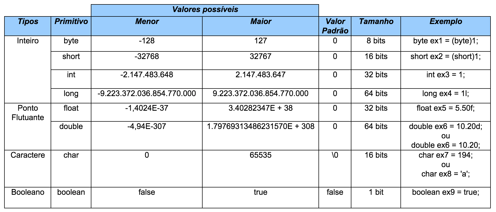

# Java Básico
## O que é JVM?
**JVM** é a máquina virtual *(Java Virtual Machine)*, que atua entre o sistema operacional e a aplicação.  
Tem como responsabilidade "traduzir" o código compilado em **JAVA** para a linguagem do sistema operacional *(Windows, Linux, MAC...)*.
- Aplicações **Java** conversam diretamente com a **JVM**, sem ter envolvimento direto com sistemas operacionais.
- Além disso a **JVM** faz otimizações de execução e atua isolando a aplicação do sistema operacional.
## O que é JRE?
**JRE** *(Java Runtime Environment)* é um ambiente de execução **JAVA**. Formado por **JVM** + **Bibliotecas** *(Libraries)*, ou seja, todos componentes necessários para a execução de uma aplicação Java.

## O que é JDK?
**JDK** *(Java Development Kit)* é uma ferramenta formada pela **JRE + Compilador + Bibliotecas** Java que tem como intuito oferecer todos recursos necessários para se desenvolver uma aplicação **JAVA**.

##Tipos Primitivos
**Quais os tipos primitivos aceitos no Java?**

## Outros assuntos:
1. [Orientação a Objetos](1-orientacao-objetos/orientacao-objetos.md)
2. [Arrays e Collections](2-arrays-collections/arrays-e-collections.md)
3. [Modificadores de Acesso e Atributos de Classe](3-modificadores-atributos/modificadores-acesso.md)
4. [Os 4 Pilares da Orientação a Objetos]()
    - Abstração
    - Herança
    - Encapsulamento
    - Poliformismo
5. [Classes Abstratas]()
6. [Interfaces]()

#### Referências:
>Java e Orientação a Objetos - [O que é Java - Cap.2 ](https://www.caelum.com.br/apostila-java-orientacao-objetos/o-que-e-java/)
